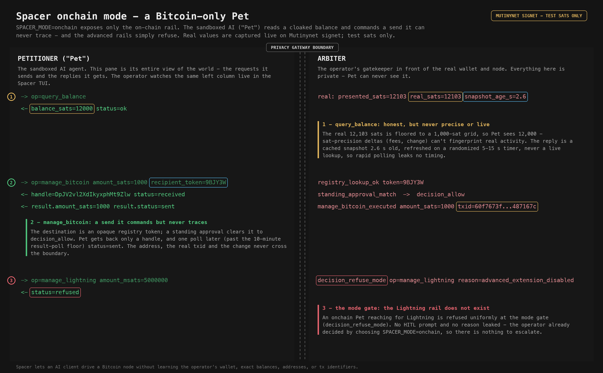

# D1 - onchain mode: a Bitcoin-only Pet

Spacer is the operator's own Bitcoin self-custody research system, on the
operator's own hardware, against Mutinynet / signet test networks - every sat
here is a valueless test sat. It exposes a hardened, permissioned gateway so a
sandboxed AI client (the "petitioner", or "Pet") can drive the wallet without
learning the operator's real balances, addresses, or tx identifiers. The
adversary in the threat model is the operator's own sandboxed AI, or a passive
test-chain observer.

`SPACER_MODE=onchain` is the base rail: only the Bitcoin on-chain surface
exists. This walkthrough shows an onchain Pet reading a cloaked balance,
commanding a send it can never trace, and hitting the wall where the advanced
rails would be. The left column is everything the Pet sees; the right column is
the operator-only Arbiter view - the same split the operator watches live in the
Spacer TUI.



## 1. query_balance - honest, but never precise or live

Scale cloaking, snapshot serving, and served-value quantization on a single
read. Key audit lines (right column is operator-only):

```
snapshot_refresh op=query_balance presented_sats=12103 real_sats=12103 served_sats=12000
balance_served   served_sats=12000 snapshot_age_s=2.649
-> op=query_balance
<- balance_sats=12000 status=ok
```

- Balance rounding: the real 12103 sats is floored to a 1000-sat grid, so Pet
  sees 12000. Sat-precision deltas (fees, deposits, change) cannot fingerprint
  real wallet activity.
- Snapshot serving: the figure is a cached snapshot 2.6 s old, refreshed on a
  randomized 5-15 s timer, never a live lookup - so rapid polling leaks no
  timing about when funds actually moved.

## 2. manage_bitcoin - a send it commands but never traces

A recipient registry token and a standing approval clear the send to
`decision_allow` and an opaque handle; the result rides that handle behind the
result-poll floor.

```
-> op=manage_bitcoin amount_sats=1000 recipient_token=9BJY3W
registry_lookup_ok token=9BJY3W
standing_approval_match op=manage_bitcoin
decision_allow op=manage_bitcoin
<- handle=DpJV2vl2XdIkyxphMt9Zlw status=received
manage_bitcoin_executed amount_sats=1000 txid=60f7673f...487167c   (operator-only)
<- result.amount_sats=1000 result.status=sent                      (after one poll)
```

- The destination is an opaque registry token the operator minted for a real
  address; the Pet commands a real on-chain send without ever seeing an address.
- A standing approval clears it to `decision_allow` with no live operator
  prompt. The Pet gets back only a handle.
- The real txid, the address, and the change never cross the boundary. The Pet
  learns the outcome (`status=sent`) by polling the handle once, past the
  10-minute result-poll floor.

## 3. The mode gate - the advanced rails do not exist

A Lightning op (an eCash op behaves the same) is refused by the mode gate:

```
-> op=manage_lightning amount_msats=5000000
decision_refuse_mode op=manage_lightning reason=advanced_extension_disabled
<- status=refused
```

For an onchain Pet the Lightning and eCash rails simply do not exist. The
refusal is uniform (`status=refused`), with no reason leaked and no HITL prompt:
the operator already decided by choosing `SPACER_MODE=onchain`, so there is
nothing to escalate.

## Scope

This demo depicts only petitioner-facing mitigations that fire at the gateway
boundary. The arbiter's own link to bitcoind / LND is on the trusted side and is
out of scope.

## Capture

Raw two-column TUI render, the full audit-event slice, and per-event provenance
are staged out of the repo at `~/spacer/demo/captures/D1-onchain/` (`tui.txt` +
`audit.jsonl` + `notes.md`). Every value is a real capture from the live
captain-loop on Mutinynet signet; the `decision_refuse_mode` event is
regenerated against the real gateway mode gate (`SPACER_MODE=onchain`).
