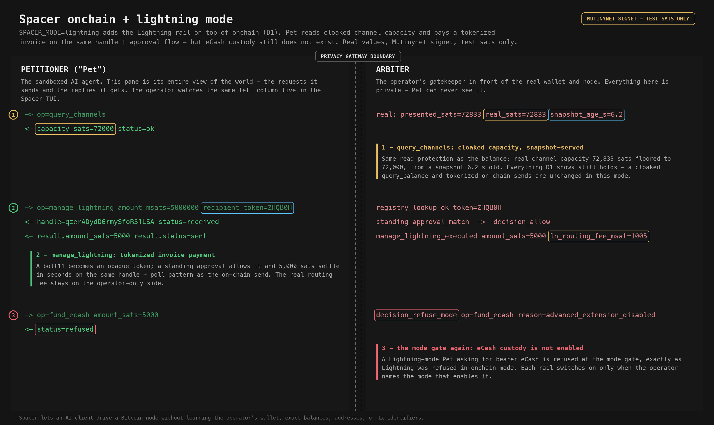

# D2 - onchain + lightning mode

Spacer lets an AI client drive a Bitcoin node without learning more about the
operator's wallet, balances, or identifiers than the task requires. It exists
so people can delegate work to a sandboxed AI agent without leaking sensitive
financial data to it: a hardened, permissioned gateway sits between the AI
client (the "petitioner", or "Pet") and the real wallet. This instance runs on
the operator's own hardware against Mutinynet / signet test networks - every
sat here is a valueless test sat. The threat model treats the petitioner
itself as the adversary, alongside a passive test-chain observer.

`SPACER_MODE=lightning` adds the Lightning rail on top of the onchain base
([D1](D1-onchain.md)). Everything D1 shows still holds - a cloaked
`query_balance` and tokenized on-chain sends are unchanged. This walkthrough
adds what Lightning brings: a cloaked capacity read and a tokenized invoice
payment on the same handle-and-approval flow. eCash custody still does not
exist. The left column is everything the Pet sees; the right column is the
operator-only Arbiter view.



## 1. query_channels - cloaked capacity, snapshot-served

The Lightning read gets the same protection as the balance read:

```
snapshot_refresh op=query_channels presented_sats=72833 real_sats=72833 served_sats=72000
capacity_served  served_sats=72000 snapshot_age_s=6.202
-> op=query_channels
<- capacity_sats=72000 status=ok
```

- Real channel capacity 72833 sats is floored to 72000 before it crosses.
- Served from a snapshot 6.2 s old, so the Pet cannot watch capacity move in
  real time.

## 2. manage_lightning - tokenized invoice payment

A bolt11 invoice becomes an opaque token; a standing approval allows it and the
payment settles in seconds on the same handle + poll pattern as the on-chain
send.

```
-> op=manage_lightning amount_msats=5000000 recipient_token=ZHQB0H
registry_lookup_ok token=ZHQB0H
standing_approval_match op=manage_lightning
decision_allow op=manage_lightning
<- handle=qzerADydD6rmySfoB51LSA status=received
manage_lightning_executed amount_sats=5000 ln_routing_fee_msat=1005   (operator-only)
<- result.amount_sats=5000 result.status=sent                         (after one poll)
```

- The invoice is tokenized exactly like an on-chain recipient; the Pet never
  sees the bolt11 or the route.
- 5000 sats settle in seconds over Lightning. The real routing fee
  (`ln_routing_fee_msat`) stays on the operator-only side.

## 3. The mode gate again - eCash custody is not enabled

A Lightning-mode Pet reaching for bearer eCash is refused, exactly as Lightning
was refused in onchain mode:

```
-> op=fund_ecash amount_sats=5000
decision_refuse_mode op=fund_ecash reason=advanced_extension_disabled
<- status=refused
```

Each rail switches on only when the operator names the mode that enables it. In
lightning mode the eCash extension is still off, so `fund_ecash` refuses
uniformly at the mode gate.

## Scope

This demo depicts only petitioner-facing mitigations that fire at the gateway
boundary. The arbiter's own link to bitcoind / LND is on the trusted side and is
out of scope.

## Capture

Raw two-column TUI render, the full audit-event slice, and per-event provenance
are staged out of the repo at `~/spacer/demo/captures/D2-onchain-lightning/`
(`tui.txt` + `audit.jsonl` + `notes.md`). Every value is a real capture from the
live captain-loop on Mutinynet signet; the `decision_refuse_mode` event is
regenerated against the real gateway mode gate (`SPACER_MODE=lightning`).
