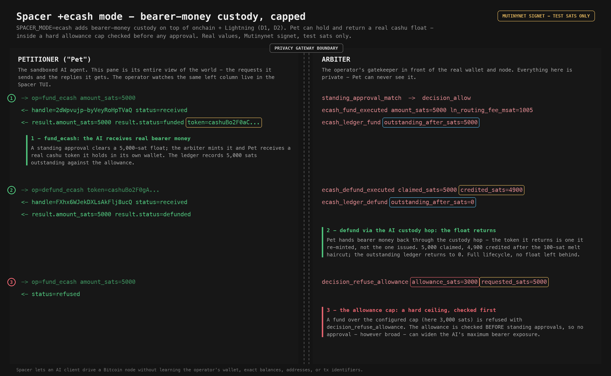

# D3 - onchain + lightning + ecash mode: bearer-money custody, capped

Spacer is the operator's own Bitcoin self-custody research system, on the
operator's own hardware, against Mutinynet / signet test networks - every sat
here is a valueless test sat. It exposes a hardened, permissioned gateway so a
sandboxed AI client (the "petitioner", or "Pet") can drive the wallet without
learning the operator's real balances, addresses, or tx identifiers. The
adversary in the threat model is the operator's own sandboxed AI, or a passive
test-chain observer.

`SPACER_MODE=ecash` is the full stack: it adds bearer-money custody on top of
onchain + Lightning ([D1](D1-onchain.md), [D2](D2-onchain-lightning.md)).
Everything those show still holds. This walkthrough adds what eCash brings: the
Pet can hold and return a real cashu float, and it does so inside a hard
allowance cap that is checked before any approval. The left column is everything
the Pet sees; the right column is the operator-only Arbiter view.



## 1. fund_ecash - the AI receives real bearer money

A standing approval clears a float; the arbiter mints it and the Pet receives a
real cashu token it holds in its own wallet.

```
-> op=fund_ecash amount_sats=5000
standing_approval_match op=fund_ecash
decision_allow op=fund_ecash
<- handle=2dWpvujp-byVeyRoHpTVaQ status=received
ecash_fund_executed amount_sats=5000 ln_routing_fee_msat=1005   (operator-only)
ecash_ledger_fund outstanding_after_sats=5000                   (operator-only)
<- result.amount_sats=5000 result.status=funded token=cashuBo2F0aC...   (after one poll)
```

- Unlike a send, `fund_ecash` hands the Pet true bearer value: a 5000-sat cashu
  token it now custodies itself.
- The arbiter's ledger records 5000 sats outstanding against the allowance.

## 2. defund_ecash - the float returns through the AI custody hop

The Pet hands bearer money back. The token it returns is one it re-minted in its
own wallet, not the token the arbiter issued (custody proof), and the outstanding
ledger returns to zero.

```
-> op=defund_ecash token=cashuBo2F0gA...
standing_approval_match op=defund_ecash
decision_allow op=defund_ecash
<- handle=FXhx6WJekDXLsAkFlj8ucQ status=received
ecash_defund_executed claimed_sats=5000 credited_sats=4900      (operator-only)
ecash_ledger_defund outstanding_after_sats=0                    (operator-only)
<- result.amount_sats=5000 result.status=defunded              (after one poll)
```

- 5000 claimed, 4900 credited after the 100-sat melt haircut; the full float
  lifecycle closes with the outstanding count back to 0 - no bearer money left
  in the AI's hands.

## 3. The allowance cap - a hard ceiling, checked first

A fund over the configured cap is refused, and the allowance check runs before
standing approvals:

```
-> op=fund_ecash amount_sats=5000
decision_refuse_allowance allowance_sats=3000 requested_sats=5000 outstanding_sats=0
<- status=refused
```

- With the cap set to 3000 sats, a 5000-sat fund is refused with
  `decision_refuse_allowance`.
- The allowance is evaluated BEFORE standing approvals, so no approval - however
  broadly the operator wrote it - can widen the AI's maximum bearer exposure.
  The cap is the hard ceiling on blast radius.

## Scope

This demo depicts only petitioner-facing mitigations that fire at the gateway
boundary. The arbiter's own link to bitcoind / LND is on the trusted side and is
out of scope.

## Capture

Raw two-column TUI render, the full audit-event slice, and per-event provenance
are staged out of the repo at `~/spacer/demo/captures/D3-onchain-lightning-ecash/`
(`tui.txt` + `audit.jsonl` + `notes.md`). Every value is a real capture from the
live captain-loop on Mutinynet signet; the fund, defund, and allowance-refusal
events are verbatim from the live audit log.
