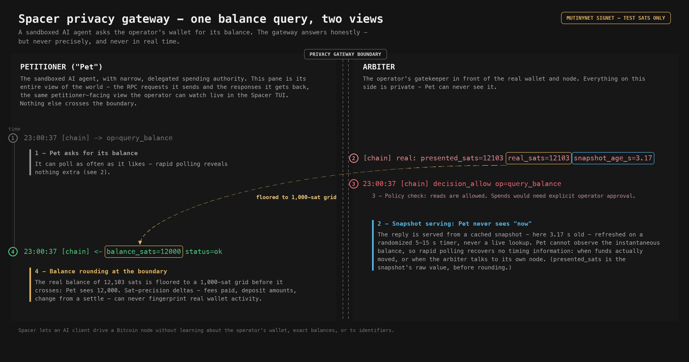

# Spacer demos

Visual walkthroughs of Spacer's privacy features.

Spacer lets an AI client drive a Bitcoin node without learning about the operator's wallet, exact balances, or tx identifiers.

> All demos run on Mutinynet signet. Every sat shown is a valueless test sat.

## Privacy mitigations

### Balance query - two views across the gateway boundary

A single `query_balance` round-trip, split across the gateway boundary: the left pane is everything the sandboxed AI agent ("Pet") sees; the right pane is the operator-side Arbiter's private view. It shows two boundary mitigations at once:

- **Balance rounding** - the real `12103` sats is floored to a 1,000-sat grid, so Pet sees `12000`. Sat-precision deltas (fees, deposits, change) can't fingerprint real activity.
- **Snapshot serving** - the reply comes from a cached snapshot refreshed on a randomized 5-15s timer, never a live lookup, so Pet can't observe the instantaneous balance or leak timing.

## Deployment-mode walkthroughs (sequence D)

`SPACER_MODE` selects the op surface; the rails are cumulative. Three demos, one per mode, each showing its own rail working and the higher rails refused by the mode gate. Every value in every panel is a real capture from the live captain-loop on Mutinynet signet.

### [D1 - onchain mode](D1-onchain.md)

A cloaked `query_balance` read, a tokenized on-chain send cleared by standing approval, and Lightning refused at the mode gate - the rail doesn't exist yet.

### [D2 - onchain + lightning mode: the fast rail layers on](D2-onchain-lightning.md)

Everything D1 shows, plus a cloaked `query_channels` capacity read and a tokenized Lightning payment on the same handle-and-approval flow. eCash still refuses at the mode gate.

### [D3 - onchain + lightning + ecash mode: bearer-money custody, capped](D3-onchain-lightning-ecash.md)

The full eCash custody lifecycle - fund, then defund back through the AI custody hop - plus the allowance cap refusing an over-limit fund *before* any standing approval is even consulted.

---

Each PNG is rendered by a small self-contained Pillow script (`generate_*.py`) using only real captured values. To reproduce demo 1: `python3 generate_01_privacy_gateway.py`.
