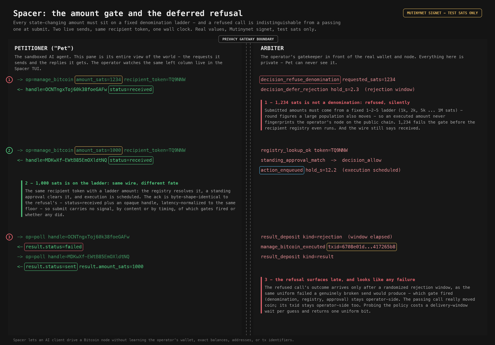

# T1 - the amount gate and the deferred refusal

Spacer lets an AI client drive a Bitcoin node without learning more about the
operator's wallet, balances, or identifiers than the task requires. It exists
so people can delegate work to a sandboxed AI agent without leaking sensitive
financial data to it: a hardened, permissioned gateway sits between the AI
client (the "petitioner", or "Pet") and the real wallet. This instance runs on
the operator's own hardware against Mutinynet / signet test networks - every
sat here is a valueless test sat. The threat model treats the petitioner
itself as the adversary, alongside a passive test-chain observer.

This walkthrough shows the two submission-side write protections working
together on one live wall clock: the **quantized-denomination gate** (every
state-changing amount must sit on a fixed ladder) and the **deferred refusal**
(a refused call is indistinguishable from a passing one at submit). Two
`manage_bitcoin` submits, same recipient token, 1,234 sats vs 1,000 sats. The
left column is everything the Pet sees; the right column is the operator-only
Arbiter view - the same split the operator watches live in the Spacer TUI.



## 1. 1,234 sats is not a denomination - refused, silently

Submitted amounts must come from a fixed 1-2-5 ladder (1k, 2k, 5k ... 1M
sats). A Pet-chosen amount is executed exactly on the public chain, so a
distinctive figure like 1,234 would fingerprint the operator's node - the
ladder keeps every executed amount inside a large anonymity set of other
people moving the same round figures.

```
-> op=manage_bitcoin amount_sats=1234 recipient_token=TQ9NNW
decision_refuse_denomination requested_sats=1234                (operator-only)
decision_defer_rejection handle=OCNTngxT... hold_s=2.324        (operator-only)
<- handle=OCNTngxToj60k38foeGAFw status=received
```

- The amount gate fires FIRST, before the recipient registry: the token is
  never resolved, no approval is consulted, nothing reaches the network.
- The wire response is `status=received` plus an opaque handle - not a
  refusal. The rejection is queued operator-side with a committed delivery
  time (`hold_s=2.3`, the compressed test-mode rejection window; production
  uses 1 h ± 30 min).

## 2. 1,000 sats is on the ladder - same wire, different fate

```
-> op=manage_bitcoin amount_sats=1000 recipient_token=TQ9NNW
registry_lookup_ok token=TQ9NNW                                 (operator-only)
standing_approval_match -> decision_allow                       (operator-only)
action_enqueued handle=MDKwXf-E... hold_s=12.218                (operator-only)
<- handle=MDKwXf-EWtB85EmOXldtNQ status=received
```

- Same token, ladder amount: the registry resolves it, a standing approval
  clears it, and execution is scheduled 12.2 s out.
- The ack is byte-shape-identical to the refusal's ack - same key set, same
  status, only the random handle differs - and both are latency-normalized to
  the same 250 ms floor. Submit carries no signal, by content or by timing,
  of which gates fired or whether any did.

## 3. The refusal surfaces late, and looks like any failure

```
-> op=poll handle=OCNTngxToj60k38foeGAFw
<- result.status=failed
-> op=poll handle=MDKwXf-EWtB85EmOXldtNQ
<- result.status=sent result.amount_sats=1000
manage_bitcoin_executed txid=6708e01d...417265b8                (operator-only)
```

- The refused call's outcome arrives only after its rejection window, as the
  uniform `failed` - exactly what a genuinely broken send would return. Which
  gate refused (denomination, registry, approval, allowance, mode) stays
  operator-side.
- The passing call really moved coin on Mutinynet; the txid stays
  operator-side. The Pet learns only `sent` plus the amount it chose itself.
- Net effect: probing the policy surface costs one delivery-window wait per
  guess and returns one uniform bit. Mapping the ladder, the registry, or an
  approval band by probing is starved, not just refused.

## Scope

This demo depicts only petitioner-facing mitigations that fire at the gateway
boundary. The arbiter's own link to bitcoind / LND is on the trusted side and
is out of scope.

## Capture

Raw two-column TUI render, the full audit-event slice, and per-event
provenance are staged out of the repo at
`~/spacer/demo/captures/T1-amount-gate/` (`tui.txt` + `audit.jsonl` +
`notes.md`). Every value is from ONE live sequence-T run
(`test-harness/scripts/live_sequence_t_runner.py`, 2026-07-23) against the
live captain-loop arbiter on Mutinynet signet - one wall clock, real
chronology, no composed slices.
