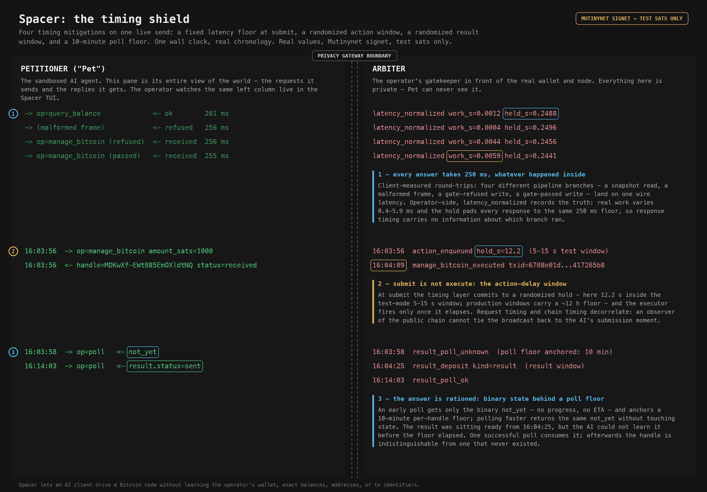

# T2 - the timing shield

Spacer lets an AI client drive a Bitcoin node without learning more about the
operator's wallet, balances, or identifiers than the task requires. It exists
so people can delegate work to a sandboxed AI agent without leaking sensitive
financial data to it: a hardened, permissioned gateway sits between the AI
client (the "petitioner", or "Pet") and the real wallet. This instance runs on
the operator's own hardware against Mutinynet / signet test networks - every
sat here is a valueless test sat. The threat model treats the petitioner
itself as the adversary, alongside a passive test-chain observer.

Timing is a side channel: how long a response takes, when a transaction hits
the chain, and how fast results become readable can each leak what happened
inside the arbiter. This walkthrough shows the four timing mitigations on one
live send - same run and wall clock as [T1](T1-amount-gate.md). The left
column is everything the Pet sees; the right column is the operator-only
Arbiter view.



## 1. Latency normalization - every answer takes 250 ms

Client-measured wire round-trips from the run, four different pipeline
branches:

```
-> op=query_balance             <- ok        261 ms
-> (malformed frame)            <- refused   256 ms
-> op=manage_bitcoin (refused)  <- received  256 ms
-> op=manage_bitcoin (passed)   <- received  255 ms
```

Operator-side, the `latency_normalized` audit event records what actually
happened per response:

```
latency_normalized floor_s=0.25 work_s=0.0012 held_s=0.2488
latency_normalized floor_s=0.25 work_s=0.0004 held_s=0.2496
latency_normalized floor_s=0.25 work_s=0.0044 held_s=0.2456
latency_normalized floor_s=0.25 work_s=0.0059 held_s=0.2441
```

The real work varies 0.4-5.9 ms by branch; the gateway holds every response
to the same 250 ms floor. Response timing carries no information about which
branch ran - and a `work_s` at the floor with `held_s=0` would flag itself to
the operator as an overrun to fix.

## 2. The action delay - submit is not execute

```
16:03:56  -> op=manage_bitcoin amount_sats=1000
16:03:56  <- handle=MDKwXf-EWtB85EmOXldtNQ status=received
16:03:56  action_enqueued hold_s=12.218                        (operator-only)
16:04:09  manage_bitcoin_executed txid=6708e01d...417265b8     (operator-only)
```

At submit, the timing layer commits to a randomized hold - here 12.2 s inside
the test-mode 5-15 s window; production windows carry a ~12 h floor - and the
executor fires only once it elapses. The Pet's request timing and the public
chain's broadcast timing decorrelate: a chain observer cannot tie the
transaction back to the moment the AI asked for it.

## 3. The result delay and the poll floor - the answer is rationed

```
16:03:58  -> op=poll   <- not_yet          (poll floor anchored: 10 min)
16:04:25  result_deposit kind=result                           (operator-only)
16:14:03  -> op=poll   <- result.status=sent
```

- An early poll returns only the binary `not_yet` - no progress, no ETA - and
  anchors that handle's 10-minute poll floor. Polling faster returns the same
  `not_yet` without consulting state, so a poll-storm learns nothing a
  10-minute cadence would not.
- The result itself became deliverable only after its own randomized
  result-delay window (deposited 16:04:25, 16 s after execution in test
  mode).
- The result sat ready for nearly ten minutes before the Pet could learn it.
  The one successful poll consumes the entry; afterwards the handle answers
  `not_yet` forever, indistinguishable from a handle that never existed.

Together: what the Pet can observe (response latency), when the network sees
effects (action delay), and when outcomes become knowable (result delay +
poll floor) are all decoupled from what the arbiter actually did and when.

## Scope

This demo depicts only petitioner-facing mitigations that fire at the gateway
boundary. The arbiter's own link to bitcoind / LND is on the trusted side and
is out of scope.

## Capture

Raw two-column TUI render, the full audit-event slice, and per-event
provenance are staged out of the repo at
`~/spacer/demo/captures/T2-timing-shield/` (`tui.txt` + `audit.jsonl` +
`notes.md`). Every value is from ONE live sequence-T run
(`test-harness/scripts/live_sequence_t_runner.py`, 2026-07-23) against the
live captain-loop arbiter on Mutinynet signet - one wall clock, real
chronology. Client-side latencies are the run's own measured round-trips
(`~/spacer/captain-loop/sequence-t/timings.json`).
